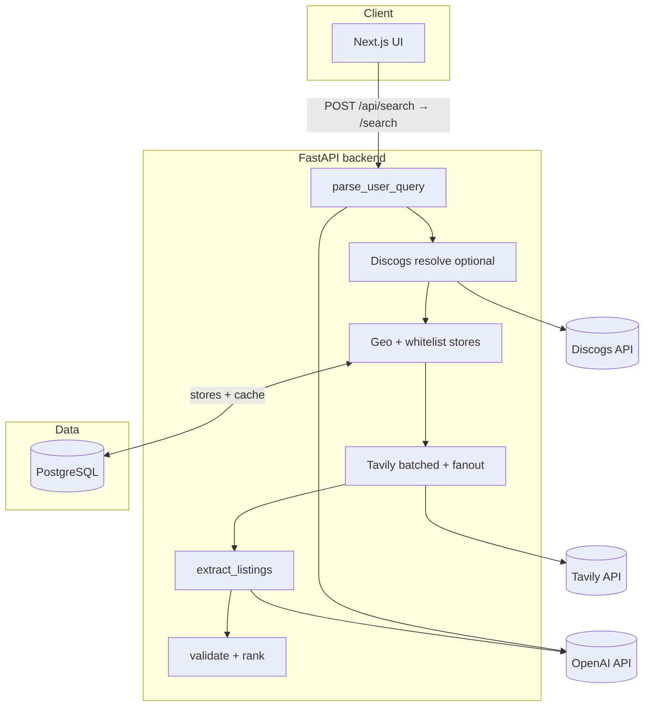

<div align="center">

# AiCrateDigger

**Natural-language search for physical music — vinyl, CD, cassette — routed through geo-aware shop domains and structured AI extraction.**

[](https://www.python.org/)
[](https://fastapi.tiangolo.com/)
[](https://nextjs.org/)
[](https://www.typescriptlang.org/)
[](https://docs.docker.com/compose/)

*Portfolio-stage project · end-to-end async pipeline · tests & structured logging*

</div>

---

## Table of contents

- [Why this exists](#why-this-exists)
- [What it does](#what-it-does)
- [Architecture](#architecture)
- [Technology stack](#technology-stack)
- [Design choices](#design-choices)
- [Repository layout](#repository-layout)
- [Quick start](#quick-start)
- [Configuration](#configuration)
- [API](#api)
- [Frontend](#frontend)
- [Observability](#observability)
- [Testing](#testing)
- [Status & limitations](#status--limitations)
- [For recruiters & reviewers](#for-recruiters--reviewers)

---

## Why this exists

Buying a specific **album** in a specific **place** usually means opening dozens of regional record-shop sites. AiCrateDigger is an experiment in **intent parsing + constrained web retrieval + LLM extraction** so one query can surface **actionable listing-shaped results** (URL, title, price hints, availability signals) instead of a generic web search page.

---

## What it does

| Capability | Description |
|------------|-------------|
| **Parse** | Single structured JSON parse from natural language: artist, album or ordinal (`album_index`), location, inferred `country_code` and `search_scope`. |
| **Resolve** | Optional **Discogs** alignment when the user references position (“second album”, “latest”) instead of a literal title. |
| **Discover stores** | When city-level indie coverage is thin, **Tavily + LLM** can propose vetted shops and upsert into a **whitelist** in Postgres. |
| **Search** | **Tavily** with **`include_domains`** batches, **geo tiers** (city → country → region → …), optional **per-shop fanout** in city tier. |
| **Extract** | Snippet-first pipeline: deterministic paths + **gpt-4o-mini** JSON extraction into listing rows. |
| **Validate & rank** | RapidFuzz gates, PDP heuristics, URL normalization, **composite ranking** (semantic, geo, store quality, tier). |
| **Explicit empty states** | When no album anchor exists after parse/Discogs, the API returns **`reason: album_unresolved`** so clients don’t look “broken”. |

---

## Architecture



**Single round-trip:** `POST /search` returns **`results`**, **`parsed`** (parser output), optional **`reason`**, and optional **`debug`** when `DEBUG=true`.

---

## Technology stack

| Layer | Choices |
|-------|---------|
| **Runtime** | Python **3.11+**, Node **18+** (typical for Next 14) |
| **API** | **FastAPI**, **Uvicorn**, **Pydantic v2**, **pydantic-settings** |
| **DB** | **PostgreSQL 15**, **SQLAlchemy 2.0** async, **asyncpg** |
| **HTTP client** | **httpx** (async to external APIs) |
| **Search** | **Tavily** (domain-constrained search, retries/backoff configurable) |
| **LLM** | **OpenAI** `gpt-4o-mini`, **AsyncOpenAI**, JSON mode for structured steps |
| **Fuzzy matching** | **RapidFuzz** |
| **Frontend** | **Next.js 14** App Router, **React 18**, **TypeScript 5** strict, **Tailwind CSS 3** |
| **Packaging** | **Poetry** (backend), **npm** (frontend) |
| **Local infra** | **Docker Compose** (optional `chroma_db` volume is legacy; app code does not use Chroma) |

---

## Design choices

1. **Tavily + snippets, not a site crawler** — Full-page scraping would raise latency, ops burden, and compliance questions. Snippets keep token use bounded and make the problem **search → extract**, not **browse → render**.

2. **Whitelist-first retrieval** — Open web search drifts to megamarket SEO. Curated **`whitelist_stores`** (Postgres, seeded from policy) plus **`include_domains`** keeps results **commerce-shaped** and easier to reason about.

3. **Geo tiers, not “paste city into every query string”** — Location drives **which domains and tiers** run; ranking uses geo as **signal**, not a hard user-location filter on every row, to reduce false negatives.

4. **One parser contract for the live path** — `parse_user_query` → `domain.parse_schema.ParsedQuery`. Older alternate parser/extractor paths remain for tests or legacy compatibility only.

5. **Structured failure over silent zeros** — **`album_unresolved`** (and OpenAPI examples on `SearchResponse`) document why a search never reached Tavily.

6. **Cost-aware defaults** — e.g. Tavily **`basic`** depth by default, chunked domains, **TTL caches**, configurable **fanout concurrency** and **HTTP retries** for transient Tavily pressure (429 / 432 / 433 / 503).

7. **Logging ready for aggregation** — `LOG_FORMAT=json` emits NDJSON-friendly records with promoted fields (`stage`, `request_id`, `reason`, …) for Loki/Datadog-style pipelines.

---

## Repository layout

```
AiCrateDigger/
├── backend/
│   ├── app/
│   │   ├── main.py                 # FastAPI app + lifespan (DB init, store seed, cache purge)
│   │   ├── config.py               # Settings (env-driven knobs)
│   │   ├── logging_config.py       # Human vs JSON log formatters
│   │   ├── routers/search.py       # /parse, /search, /search-listings
│   │   ├── pipeline/
│   │   │   └── vinyl_search.py     # Orchestrator: parse → tiers → Tavily → extract → validate
│   │   ├── pipeline_context.py     # Per-request stage trace (DEBUG payload)
│   │   ├── agents/
│   │   │   ├── parser/             # parse_user_query + steps
│   │   │   └── extractor/        # extract_listings + evidence / verify helpers
│   │   ├── services/               # tavily_service, discogs_service, store_discovery, batches
│   │   ├── policies/               # geo_scope, search_dsl, listing_rank, eu_stores, …
│   │   ├── db/                     # database.py, cache.py, store_loader.py
│   │   ├── domain/                 # parse_schema, listing_schema
│   │   ├── models/                 # API models (SearchResponse, ListingResult, …)
│   │   ├── validators/             # listings validation gates
│   │   └── llm/                    # small coercion helpers
│   └── tests/                      # unittest suite (see Testing)
├── frontend/
│   ├── app/                        # App Router, /api/search & /api/parse proxies
│   ├── components/                 # SearchExperience, cards, dev JSON inspector
│   └── lib/api.ts                  # Typed fetch helpers
├── docker-compose.yml
├── .env.example                    # Copy to .env — never commit secrets
└── README.md
```

---

## Quick start

### Prerequisites

- Docker & Docker Compose **or** Poetry + Node + PostgreSQL
- **OpenAI** and **Tavily** API keys

### 1. Environment

```bash
cp .env.example .env
# Edit .env — set OPENAI_API_KEY and TAVILY_API_KEY at minimum
```

### 2. Docker Compose (recommended)

From the repo root:

```bash
docker compose up --build
```

| Service | URL |
|---------|-----|
| Frontend | http://localhost:3000 |
| Backend API | http://localhost:8000 |
| PostgreSQL (host port) | localhost:**5433** (default; see `docker-compose.yml`) |

### 3. Backend only (Poetry)

```bash
cd backend
poetry install
export OPENAI_API_KEY=... TAVILY_API_KEY=...
poetry run uvicorn app.main:app --reload --host 0.0.0.0 --port 8000
```

### 4. Frontend only (npm)

```bash
cd frontend
npm install
npm run dev
```

Use **`NEXT_PUBLIC_BACKEND_URL`** for browser-side calls where applicable, and **`BACKEND_URL`** for the Next.js server route proxy (`frontend/app/api/search/route.ts`).

---

## Configuration

### Required & common variables

| Variable | Required | Purpose |
|----------|----------|---------|
| `OPENAI_API_KEY` | **Yes** | Parser + extractor LLM calls |
| `TAVILY_API_KEY` | **Yes** | Web search |
| `DISCOGS_TOKEN` | No | Stronger album resolution for ordinal queries |
| `DATABASE_URL` | No* | Postgres (`postgresql+asyncpg://…` or `postgresql://…`) — *Compose supplies default |
| `DEBUG` | No | When `true`, `/search` includes full pipeline **`debug`** trace |
| `LOG_LEVEL` | No | Default `INFO` |
| `LOG_FORMAT` | No | `human` (local) or **`json`** (aggregators) |

**Important knobs** (Tavily retries, fanout concurrency, geo caps, fuzzy thresholds, cache TTLs) live in **`backend/app/config.py`** as typed **`Settings`** fields — prefer changing env-backed settings over editing pipeline code.

---

## API

| Method | Path | Description |
|--------|------|-------------|
| `GET` | `/health` | Liveness |
| `POST` | `/parse` | Parser only (`ParsedQuery`) |
| `POST` | `/search` | Full pipeline: **`results`**, **`parsed`**, optional **`reason`**, optional **`debug`** |
| `POST` | `/search-listings` | Alias of `/search` |

**Body:** `{ "query": "Natural language query…" }`

Interactive docs: **`/docs`** (Swagger) when the backend is running.

---

## Frontend

- **Next.js 14** App Router with a single-page search experience and **server-side proxy** to the backend (avoids CORS for the main flow).
- **Accessible health hint** via `fetchHealth()` on the home page (`aria-live`).
- **Dev inspector** panels (parse JSON, optional DEBUG pipeline stages, results array) for demos and interviews.

---

## Observability

- Central **`logging_config`**: switch **`LOG_FORMAT=json`** in deployment for structured logs.
- Pipeline stages attach **`request_id`** and domain-specific **`extra`** fields suitable for filtering in log drains.

**Operational note:** Keep **`DEBUG=false`** on any publicly reachable deployment — otherwise **`debug`** payloads in JSON responses can expose internal traces.

---

## Testing

```bash
cd backend
export OPENAI_API_KEY=dummy TAVILY_API_KEY=dummy   # required by Settings() in some suites
poetry run python -m unittest discover -s tests -p 'test_*.py' -v
```

The suite focuses on **policies, extractors, validators, geo ranking, locale variants, and pipeline edge cases** (e.g. early exit when the album cannot be resolved). **CI wiring (GitHub Actions) is left as an easy addition** for your fork.

---

## Status & limitations

| Topic | Note |
|-------|------|
| **Maturity** | **0.1.x — portfolio / demo grade**, not a monetized marketplace |
| **Migrations** | **SQLAlchemy `create_all`** + targeted `ALTER … IF NOT EXISTS` — plan **Alembic** before multi-environment schema evolution |
| **Rate limiting / auth** | Not included — rely on edge gateway or private networking for public demos |
| **Result quality** | Depends on Tavily coverage, snippet richness, and validation thresholds; tuning is expected |
| **Legal / ToS** | Uses third-party APIs; review vendor terms before commercial use |

---

## For recruiters & reviewers

**Suggested reading order (≈15 minutes):**

1. This README  
2. `backend/app/pipeline/vinyl_search.py` — orchestration and geo tier loop  
3. `backend/app/services/tavily_service.py` — batching, retries, domain hygiene  
4. `backend/app/policies/listing_rank.py` — scoring philosophy  
5. `backend/tests/` — regression coverage

If you **clone and run Compose with valid keys**, you get a **working vertical slice** suitable for a portfolio conversation about **async Python, LLM boundaries, search UX, and pragmatic tradeoffs**.

---

## License & naming

Confirm licensing before redistribution. The FastAPI app title may appear as **AiCrateDigg** in metadata while the product name is **AiCrateDigger** — same codebase.

---

<div align="center">

**Built as a learning & portfolio piece — PRs and forks welcome.**

</div>
