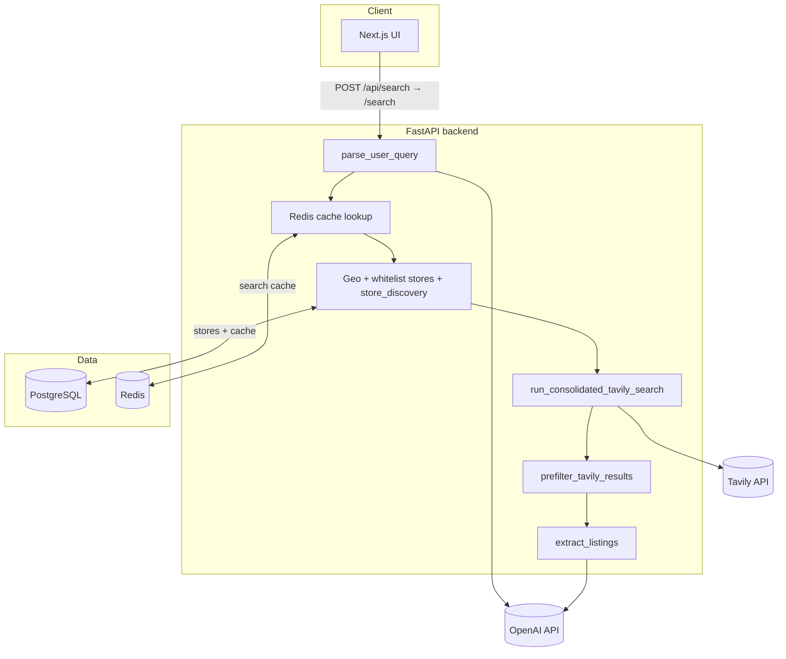

<div align="center">

# AiCrateDigger

**Natural-language search for physical music — vinyl, CD, cassette — routed through geo-aware shop domains and structured AI extraction.**

[](https://www.python.org/)
[](https://fastapi.tiangolo.com/)
[](https://nextjs.org/)
[](https://www.typescriptlang.org/)
[](https://docs.docker.com/compose/)

*Portfolio-stage project · end-to-end async pipeline · tests & structured logging*

**Live demo:** [https://aicratedigger.dejanvitomirov.com/](https://aicratedigger.dejanvitomirov.com/)

</div>

---

## Table of contents

- [Live demo](#live-demo)
- [Documentation](#documentation)
- [Why this exists](#why-this-exists)
- [What it does](#what-it-does)
- [Architecture](#architecture)
- [Technology stack](#technology-stack)
- [Design choices](#design-choices)
- [Repository layout](#repository-layout)
- [Quick start](#quick-start)
- [Configuration](#configuration)
- [API](#api)
- [Frontend](#frontend)
- [Observability](#observability)
- [Testing](#testing)
- [Status & limitations](#status--limitations)
- [For recruiters & reviewers](#for-recruiters--reviewers)

---

## Live demo

The app is deployed in production at **[https://aicratedigger.dejanvitomirov.com/](https://aicratedigger.dejanvitomirov.com/)**. Search traffic goes through the Next.js BFF (`/api/search`, `/api/parse`); the FastAPI backend is not publicly exposed.

To run the same stack locally, see [Quick start](#quick-start) or [docs/deployment.md](./docs/deployment.md).

---

## Documentation

Full technical documentation lives in **[docs/](./docs/README.md)** — architecture, backend, frontend, database, API reference, configuration, deployment, testing, evaluation, security, and operations.

---

## Why this exists

Buying a specific **album** in a specific **place** usually means opening dozens of regional record-shop sites. AiCrateDigger is an experiment in **intent parsing + constrained web retrieval + LLM extraction** so one query can surface **actionable listing-shaped results** (URL, title, price hints, availability signals) instead of a generic web search page.

---

## What it does

| Capability | Description |
|------------|-------------|
| **Parse** | Single structured JSON parse from natural language: artist, album or ordinal (`album_index` + LLM `resolved_album`), location, inferred `country_code` and `search_scope`. |
| **Discover stores** | When city-level indie coverage is thin, or when Tavily surfaces unknown shop hosts, **Tavily + LLM** can propose vetted shops and upsert into a **whitelist** in Postgres. |
| **Search** | **One consolidated Tavily call** per request (`advanced` depth, configurable `max_results`), with active whitelist domains as a prefilter signal. |
| **Prefilter** | Python gate on raw Tavily rows: blacklist noise hosts, require PDP-shaped URLs from unknown shops, dedupe per host, cap candidates before LLM extract. |
| **Extract** | Snippet-first pipeline: deterministic paths + **gpt-4o-mini** JSON extraction into listing rows. |
| **Cache** | **Redis** (7-day TTL) + optional Postgres rows for repeat queries and operator visibility. |
| **Explicit empty states** | When no album anchor exists after parse, the API returns **`reason: album_unresolved`** so clients don’t look “broken”. |

---

## Architecture



**Single round-trip:** `POST /search` returns **`results`**, **`parsed`** (parser output), optional **`reason`**, and optional **`debug`** when `DEBUG=true`.

---

## Technology stack

| Layer | Choices |
|-------|---------|
| **Runtime** | Python **3.11+**, Node **18+** (typical for Next 14) |
| **API** | **FastAPI**, **Uvicorn**, **Pydantic v2**, **pydantic-settings** |
| **DB** | **PostgreSQL 15**, **SQLAlchemy 2.0** async, **asyncpg** |
| **HTTP client** | **httpx** (async to external APIs) |
| **Search** | **Tavily** (domain-constrained search, retries/backoff configurable) |
| **LLM** | **OpenAI** `gpt-4o-mini`, **AsyncOpenAI**, JSON mode for structured steps |
| **Fuzzy matching** | **RapidFuzz** |
| **Frontend** | **Next.js 14** App Router, **React 18**, **TypeScript 5** strict, **Tailwind CSS 3** |
| **Packaging** | **Poetry** (backend), **npm** (frontend) |
| **Local infra** | **Docker Compose** (Postgres, Redis, backend, frontend) |

---

## Design choices

1. **Tavily + snippets, not a site crawler** — Full-page scraping would raise latency, ops burden, and compliance questions. Snippets keep token use bounded and make the problem **search → extract**, not **browse → render**.

2. **Whitelist-first retrieval** — Open web search drifts to megamarket SEO. Curated **`whitelist_stores`** (Postgres, seeded from policy) plus inline **`store_discovery`** keeps results **commerce-shaped** and easier to reason about.

3. **One Tavily call, not a tier loop** — Location is parsed once and influences store discovery and prefilter whitelist signals; the hot path issues **one** consolidated Tavily request rather than widening geo tiers with multiple HTTP calls.

4. **One parser contract** — `parse_user_query` → `domain.parse_schema.ParsedQuery`. Ordinal album titles are resolved inside the same LLM parse (`resolved_album`), not via a separate metadata service.

5. **Structured failure over silent zeros** — **`album_unresolved`** (and OpenAPI examples on `SearchResponse`) document why a search never reached Tavily.

6. **Cost-aware defaults** — e.g. single-call **`advanced`** Tavily depth with a capped candidate pool, **Redis TTL cache**, Tavily **HTTP retries**, and a per-request **circuit breaker** for hard throttling.

7. **Logging ready for aggregation** — `LOG_FORMAT=json` emits NDJSON-friendly records with promoted fields (`stage`, `request_id`, `reason`, …) for Loki/Datadog-style pipelines.

---

## Repository layout

```
AiCrateDigger/
├── backend/
│   ├── app/
│   │   ├── main.py                 # FastAPI app + lifespan (DB init, store seed, cache purge)
│   │   ├── core/                   # config, logging, db (infra)
│   │   │   ├── config.py           # Settings (env-driven knobs)
│   │   │   ├── logging_config.py   # Human vs JSON log formatters
│   │   │   └── db/                 # database.py, cache.py, store_loader.py, redis_cache.py
│   │   ├── api/                    # FastAPI routers
│   │   │   └── routers/search.py # /parse, /search, /search-listings
│   │   └── domains/               # vertical slices
│   │       ├── query_parser/      # parse_user_query, parse_schema
│   │       ├── search_pipeline/    # vinyl_search, pipeline_context, models
│   │       └── engine/            # Tavily (search/), extraction/, policies/, listing_schema, validators, llm/
│   ├── eval/                       # dataset + CLI harness (edge_cases.json)
│   └── tests/                      # unittest suite (see Testing)
├── frontend/
│   ├── app/                        # App Router, /api/search & /api/parse proxies
│   ├── components/                 # SearchExperience, cards, dev JSON inspector
│   └── lib/api.ts                  # Typed fetch helpers
├── docker-compose.yml
├── .env.example                    # Copy to .env — never commit secrets
└── README.md
```

**Backend imports:** there is no top-level `services/` package — use `app.domains.engine.search` (lazy package facade) or concrete submodules such as `single_call` / `prefilter` so pure tests do not pull in `httpx` until needed.

---

## Quick start

### Prerequisites

- Docker & Docker Compose **or** Poetry + Node + PostgreSQL
- **OpenAI** and **Tavily** API keys

### 1. Environment

```bash
cp .env.example .env
# Edit .env — set OPENAI_API_KEY and TAVILY_API_KEY at minimum
```

### 2. Docker Compose (recommended)

From the repo root:

```bash
docker compose up --build
```

| Service | URL |
|---------|-----|
| Frontend (use this in the browser) | http://localhost:3000 |
| Backend API | Docker network only — not published on the host by default. Uncomment `ports` in `docker-compose.yml` for `127.0.0.1:8000` debugging. |
| PostgreSQL (host port) | localhost:**5433** (default; see `docker-compose.yml`) |

Set **`INTERNAL_API_SECRET`** in `.env` (same value for `backend` + `frontend` services). Generate a strong value for production (`openssl rand -hex 32`). The UI calls the API via Next.js `/api/*` proxies, which attach the secret server-side.

### 3. Backend only (Poetry)

```bash
cd backend
poetry install
export OPENAI_API_KEY=... TAVILY_API_KEY=...
poetry run uvicorn app.main:app --reload --host 0.0.0.0 --port 8000
```

### 4. Frontend only (npm)

```bash
cd frontend
npm install
npm run dev
```

Use **`BACKEND_URL`** for the Next.js server route proxy (`frontend/app/api/search/route.ts`). **`NEXT_PUBLIC_BACKEND_URL`** is for optional SSR health checks only — do not point browser search traffic at the backend directly.

---

## Configuration

### Required & common variables

| Variable | Required | Purpose |
|----------|----------|---------|
| `OPENAI_API_KEY` | **Yes** | Parser + extractor LLM calls |
| `TAVILY_API_KEY` | **Yes** | Web search |
| `DATABASE_URL` | No* | Postgres (`postgresql+asyncpg://…` or `postgresql://…`) — *Compose supplies default |
| `REDIS_URL` | No | Search-result cache (7-day TTL); no-ops when unset |
| `DEBUG` | No | When `true`, `/search` includes full pipeline **`debug`** trace |
| `SEARCH_RATE_LIMIT_ENABLED` | No | Per-IP limit on `/search`, `/search-listings`, `/parse` (default `true`) |
| `SEARCH_RATE_LIMIT_FAIL_CLOSED` | No | When `true`, missing Redis returns **503** (set `false` only for local backend-without-Redis) |
| `SEARCH_QUERY_MAX_LENGTH` | No | Max characters in search/parse body (default **512**) |
| `INTERNAL_API_SECRET` | No* | BFF shared secret; same value on backend + frontend. Unset = dev bypass (*set in production) |
| `GLOBAL_DAILY_QUOTA_ENABLED` | No | Account-wide Redis daily caps (default `true`) |
| `GLOBAL_DAILY_QUOTA_FAIL_CLOSED` | No | Block provider calls when Redis is down (default `true`) |
| `GLOBAL_DAILY_QUOTA_PARSE_MAX` | No | Max OpenAI parses/day — includes every `/search` parse before cache (default **500**, `0` = off) |
| `GLOBAL_DAILY_QUOTA_TAVILY_MAX` | No | Max Tavily HTTP calls/day (default **200**, `0` = off) |
| `GLOBAL_DAILY_QUOTA_OPENAI_EXTRACT_MAX` | No | Max extractor + store-discovery LLM calls/day (default **300**, `0` = off) |
| `LOG_LEVEL` | No | Default `INFO` |
| `LOG_FORMAT` | No | `human` (local) or **`json`** (aggregators) |

**Important knobs** (Tavily single-call limits, prefilter caps, opportunistic discovery, circuit breaker, cache TTLs) live in **`backend/app/core/config.py`** as typed **`Settings`** fields — prefer changing env-backed settings over editing pipeline code.

---

## API

| Method | Path | Description |
|--------|------|-------------|
| `GET` | `/health` | Liveness |
| `POST` | `/parse` | Parser only (`ParsedQuery`) |
| `POST` | `/search` | Full pipeline: **`results`**, **`parsed`**, optional **`reason`**, optional **`debug`** |
| `POST` | `/search-listings` | Alias of `/search` |

**Body:** `{ "query": "Natural language query…" }`

Interactive docs: **`/docs`** (Swagger) when the backend is running.

---

## Frontend

- **Next.js 14** App Router with a single-page search experience and **server-side proxy** to the backend (avoids CORS for the main flow).
- **Accessible health hint** via `fetchHealth()` on the home page (`aria-live`).
- **Dev inspector** panels (parse JSON, optional DEBUG pipeline stages, results array) for demos and interviews.

---

## Observability

- Central **`app.core.logging_config`**: switch **`LOG_FORMAT=json`** in deployment for structured logs.
- Pipeline stages attach **`request_id`** and domain-specific **`extra`** fields suitable for filtering in log drains.

**Operational note:** Keep **`DEBUG=false`** on any publicly reachable deployment — otherwise **`debug`** payloads in JSON responses can expose internal traces.

---

## Pipeline evaluation

Eighteen curated edge cases (parse geo/ordinals, album-unresolved negatives, store-discovery cities, full pipeline stage traces) live in **`backend/eval/dataset/edge_cases.json`**.

**Docker (recommended — uses Compose Postgres + Redis):**

```bash
# Requires OPENAI_API_KEY and TAVILY_API_KEY in .env or the environment
# Use --build after pipeline or dataset changes (eval image has no live volume mount)
docker compose --profile eval run --rm --build eval

# Single case, JSON report, or parse-only subset
docker compose --profile eval run --rm eval -- --case global_artist_album
docker compose --profile eval run --rm eval -- --json-out /tmp/eval-report.json
docker compose --profile eval run --rm eval -- --mode parse
docker compose --profile eval run --rm eval -- --list
```

**Local (from `backend/`):**

```bash
poetry run python -m eval.cli
poetry run python -m eval.cli --case city_local_barcelona --mode full
```

By default the harness **bypasses Redis cache** so each run exercises Tavily and downstream stages. Pass `--use-cache` to allow cache hits. Exit code is **0** when all selected cases pass, **1** otherwise.

---

## Testing

```bash
cd backend
export OPENAI_API_KEY=dummy TAVILY_API_KEY=dummy   # required unless already in .env
poetry run python -m unittest tests.test_app_http_e2e -v
```

`tests/test_app_http_e2e.py` mounts the real FastAPI app and asserts **routing, validation (`422`s), malformed JSON behaviour, mocked `/parse`/`/search` wiring, `/search-listings` alias parity**, and **`/openapi.json`/`/health`** — without calling OpenAI/Tavily/Postgres (DB/Redis URLs are cleared for this module).

For a full **`discover`** run (only this file ships today):

```bash
poetry run python -m unittest discover -s tests -p 'test_*.py' -v
```

---

## Status & limitations

| Topic | Note |
|-------|------|
| **Maturity** | **0.1.x — portfolio / demo grade** ([live deployment](https://aicratedigger.dejanvitomirov.com/)), not a monetized marketplace |
| **Migrations** | **SQLAlchemy `create_all`** + targeted `ALTER … IF NOT EXISTS` — plan **Alembic** before multi-environment schema evolution |
| **Rate limiting / auth** | Not included — rely on edge gateway or private networking for public demos |
| **Result quality** | Depends on Tavily coverage, snippet richness, and validation thresholds; tuning is expected |
| **Legal / ToS** | Uses third-party APIs; review vendor terms before commercial use |

---

## For recruiters & reviewers

**Suggested reading order (≈15 minutes):**

1. Try the [live demo](https://aicratedigger.dejanvitomirov.com/) or this README  
2. `backend/app/domains/search_pipeline/vinyl_search.py` — consolidated orchestration (cache → stores → Tavily → prefilter → extract)  
3. `backend/app/domains/engine/search/single_call.py` — Tavily query construction and single-call fetch  
4. `backend/app/domains/engine/search/prefilter.py` — candidate gating before LLM extract  
5. `backend/tests/` — regression coverage

If you **clone and run Compose with valid keys**, you get the same **working vertical slice** as production — suitable for a portfolio conversation about **async Python, LLM boundaries, search UX, and pragmatic tradeoffs**.

---

## License & naming

Confirm licensing before redistribution. The FastAPI app title may appear as **AiCrateDigg** in metadata while the product name is **AiCrateDigger** — same codebase.

---

<div align="center">

**Built as a learning & portfolio piece — PRs and forks welcome.**

</div>
