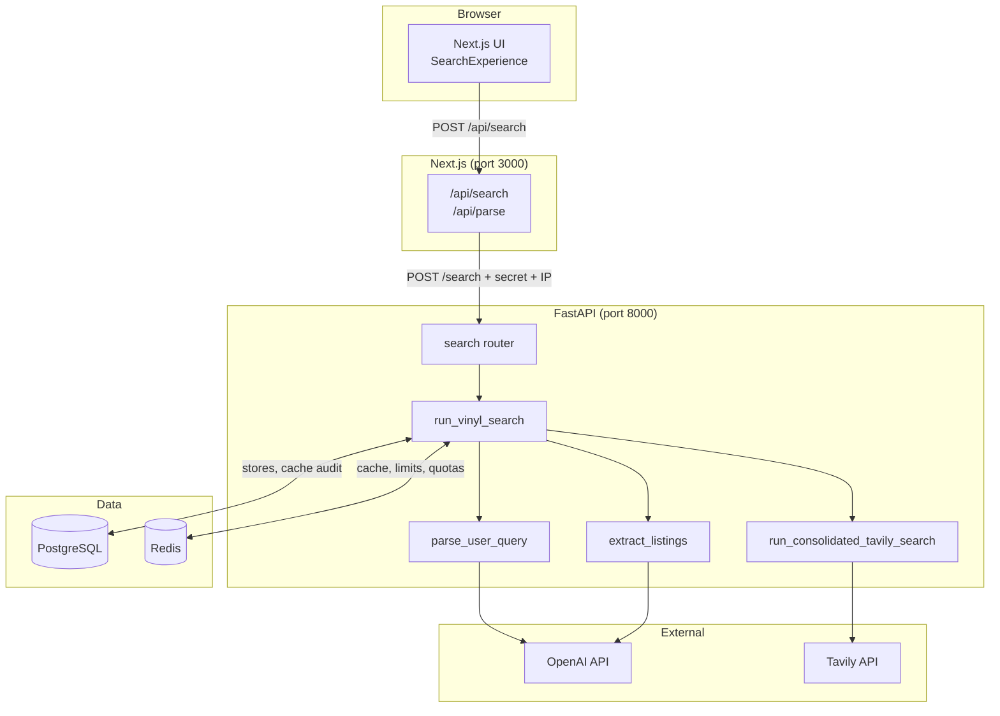

# Architecture

## System context

AiCrateDigger is a two-tier web application: a **Next.js frontend** (BFF + UI) and a **FastAPI backend** (search pipeline). Both connect to **PostgreSQL** (persistent store catalogue and cache audit) and **Redis** (hot search cache, rate limits, daily quotas). External dependencies are **OpenAI** and **Tavily**.



---

## Request lifecycle

A typical search follows this path:

```
Browser
  → POST /api/search { query }
    → Next.js route handler (production guard, proxy headers)
      → POST /search { query }
        → require_internal_api_secret
        → ip_rate_limiter (Redis)
        → run_vinyl_search()
          → parse_user_query()          [OpenAI, quota: PARSE]
          → album anchor check
          → cache lookup                [Redis → Postgres]
          → ensure_local_coverage()     [store discovery if needed]
          → load_active_stores()
          → run_consolidated_tavily_search()  [Tavily, quota: TAVILY]
          → opportunistic store discovery (background)
          → prefilter_tavily_results()
          → extract_listings()          [OpenAI, quota: OPENAI_EXTRACT]
          → dedupe + limit results
          → cache write                 [Redis + Postgres]
        ← SearchResponse
      ← proxied JSON
  ← render ListingResultCard rows
```

**Single round-trip:** The UI uses one `POST /api/search` call. The response includes `results`, `parsed`, optional `reason`, and optional `debug` (when `DEBUG=true` on the backend).

---

## Pipeline stages

Production hot path: `run_vinyl_search()` in `backend/app/domains/search_pipeline/vinyl_search.py` (stage helpers in `search_pipeline/stages/`).

| Stage | Module | Purpose |
|-------|--------|---------|
| 1. Parse | `query_parser/parse_user_query.py` | Natural language → `ParsedQuery` |
| 2. Album resolve | `vinyl_search.py` | `effective_album = resolved_album or album`; exit early if empty |
| 3. Cache lookup | `core/db/redis_cache.py`, `core/db/cache.py` | Skip provider calls on hit |
| 4. Local coverage | `engine/search/store_discovery/` | Background discovery when city shops are thin |
| 5. Store load | `core/db/store_loader.py` | Active whitelist domains for prefilter/Tavily |
| 6. Tavily search | `engine/search/single_call.py` | One consolidated web search |
| 6.5 Opportunistic discovery | `store_discovery/` | Background upsert of unknown shop hosts from snippets |
| 7. Prefilter | `engine/search/prefilter/` | Blacklist, PDP heuristics, per-host cap |
| 8. Extract | `engine/extraction/steps/` | Deterministic + LLM listing extraction |
| 9. Dedupe | `vinyl_search.py` | One listing per host, score sort, cap |
| 10. Cache write | Redis + Postgres | Persist for repeat queries |

Wrapped in `tavily_circuit_breaker_scope()` to fail fast on burst Tavily throttling.

---

## Extraction sub-pipeline

`extract_listings()` orchestrates five steps:

```
step_01_snippet_prefilter   → collect_snippet_candidates()
step_02_listing_deterministic → deterministic_listings_from_candidates()
step_03_listing_llm_extract   → llm_extract()
step_04_merge_llm_listings    → merge_llm_rows_into_listings()
step_05_listings_orchestrator → coordinates above
```

Internal model: `Listing` (`engine/listing_schema.py`). API output: `ListingResult` (`search_pipeline/models/result.py`).

---

## Domain model boundaries

```
┌─────────────────────────────────────────────────────────┐
│  API layer (routers/search.py)                          │
│  ParseRequest, SearchResponse, HTTP concerns            │
└──────────────────────────┬──────────────────────────────┘
                           │
┌──────────────────────────▼──────────────────────────────┐
│  Search pipeline (search_pipeline/)                     │
│  Orchestration, debug context, API DTO mapping          │
└──────────────────────────┬──────────────────────────────┘
                           │
        ┌──────────────────┼──────────────────┐
        ▼                  ▼                  ▼
┌───────────────┐  ┌───────────────┐  ┌───────────────┐
│ query_parser  │  │ engine/search │  │ engine/extract│
│ ParsedQuery   │  │ Tavily, filter│  │ Listing rows  │
└───────────────┘  └───────────────┘  └───────────────┘
                           │
┌──────────────────────────▼──────────────────────────────┐
│  Core infrastructure (core/)                            │
│  Config, DB, Redis cache, rate limit, quota, auth         │
└─────────────────────────────────────────────────────────┘
```

**Lazy imports:** `app/domains/engine/search/__init__.py` is lazy — import submodules directly when you need pure helpers without loading `httpx`.

---

## Frontend architecture

The frontend is a **Backend-for-Frontend (BFF)** pattern:

- Browser calls same-origin `/api/search` only
- Next.js route handlers attach `X-Internal-Api-Secret` and `X-Forwarded-For`
- Backend validates secret and rate-limits by resolved client IP
- API keys never reach the browser

See [Frontend](./frontend.md) for component and routing details.

---

## Cache architecture

Two-tier search response cache:

1. **Redis** — primary hot path (`cratedigger:search:v3:...`), 7-day TTL
2. **Postgres** — SHA-256 keyed audit/fallback in `search_response_cache`

Lookup order: Redis → Postgres. Writes go to both (when configured).

When `DEBUG=true`: cache reads are bypassed (writes to Postgres may still occur for operator audit). Schema version `PIPELINE_CACHE_SCHEMA_VERSION = 3` in `search_cache_key.py`.

See [Database](./database.md) for schema and key format.

---

## Startup lifecycle

`app/main.py` lifespan on startup:

1. `validate_production_settings()` — fail fast if `APP_ENV=production` misconfigured
2. `init_db_from_settings()` — `create_all`, inline alters, seed/sync whitelist stores
3. `purge_expired_search_cache_rows()` — Postgres cache cleanup
4. `purge_stale_pipeline_cache_versions()` — Redis schema version sweep

On shutdown: dispose SQLAlchemy engine and Redis client.

---

## Deployment topology

### Development (`docker-compose.yml`)

| Service | Published ports | Notes |
|---------|-----------------|-------|
| frontend | 3000 | Bind mount for hot reload |
| backend | expose 8000 only | Optional host publish commented out |
| db | 5433 → 5432 | Named volume `pgdata` |
| redis | 6379 | Named volume `redisdata` |
| eval | profile `eval` | Offline evaluation CLI |

### Production (`docker-compose.prod.yml`)

| Service | Published ports | Notes |
|---------|-----------------|-------|
| frontend | `${FRONTEND_PORT:-3000}` | Only public entry point |
| backend | expose 8000 | Internal Docker network only |
| db, redis | none | Internal only |
| backend workers | 2 Uvicorn workers | `APP_ENV=production` |

**Live deployment:** [https://aicratedigger.dejanvitomirov.com/](https://aicratedigger.dejanvitomirov.com/) (HTTPS reverse proxy → frontend container).

See [Deployment](./deployment.md) for full instructions.
