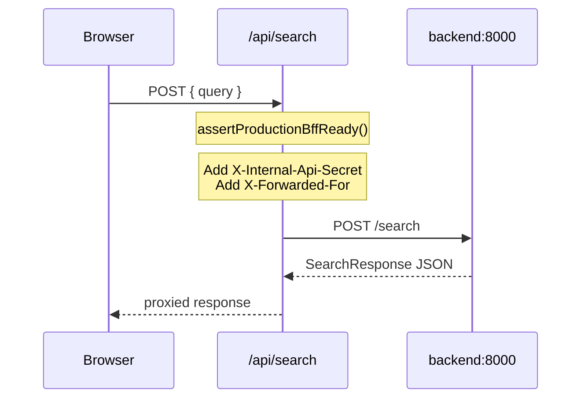

# Frontend

The frontend is a **Next.js 14** application using the App Router. It provides a single-page search experience and acts as a **Backend-for-Frontend (BFF)** — proxying API calls to FastAPI with server-side secrets.

---

## Project structure

```
frontend/
├── app/
│   ├── layout.tsx              # Root layout, fonts, metadata
│   ├── page.tsx                # Home page (SSR health + SearchExperience)
│   ├── globals.css             # Tailwind + grain overlay
│   └── api/
│       ├── search/route.ts     # BFF → POST /search
│       └── parse/route.ts      # BFF → POST /parse
├── components/
│   ├── README.md               # Component layout and data-flow notes
│   ├── search/
│   │   ├── SearchExperience.tsx    # Main client shell
│   │   ├── DigSearchForm.tsx       # Search input + submit
│   │   ├── SearchHero.tsx          # Hero copy
│   │   ├── SearchStatusBanner.tsx  # Status / empty states
│   │   └── search-copy.ts          # User-facing copy constants
│   ├── listing/
│   │   ├── ListingResultCard.tsx   # Result row
│   │   └── SearchResultsList.tsx   # Results list wrapper
│   ├── dev/
│   │   ├── SearchDevInspector.tsx  # Debug pipeline JSON panels
│   │   └── DevJsonPanel.tsx        # Copyable JSON block
│   └── ui/
│       ├── HugeVinylRecord.tsx     # Background vinyl SVG
│       └── RateLimitModal.tsx      # 429 UX
├── hooks/
│   ├── useDigSearch.ts         # Search state + API call
│   ├── useRampProgress.ts      # Animated progress bar (UX, not SSE)
│   └── useTypewriterLoop.ts    # Example query typewriter
├── lib/
│   ├── api.ts                  # Browser client (same-origin)
│   ├── api-types.ts            # TypeScript DTOs
│   ├── api-server.ts           # RSC health fetch
│   ├── config.ts               # Browser-safe env helpers
│   ├── server-backend-url.ts   # Server-only backend URL
│   ├── backend-proxy-headers.ts
│   ├── production-guard.ts     # Production BFF validation
│   ├── listing-display.ts      # Listing title/price formatting
│   └── search-empty.ts         # Empty-state copy helpers
├── public/
│   └── lp.png                  # Favicon / app icon
├── Dockerfile
├── next.config.mjs
├── tailwind.config.ts
├── tsconfig.json               # Path alias: @/* → ./*
└── package.json
```

**Path alias:** `@/*` maps to the frontend root (see `tsconfig.json`). Example: `import { postSearch } from "@/lib/api"`.

**Not present:** middleware, UI component library (no Shadcn), automated tests, ESLint/Prettier in CI.

---

## Routing

### Pages

| Route | File | Type | Description |
|-------|------|------|-------------|
| `/` | `app/page.tsx` | Server Component | Health probe + main search UI |
| Root shell | `app/layout.tsx` | Layout | Fonts, metadata, body classes |

Only one user-facing page. No nested layouts, `loading.tsx`, or `error.tsx`.

### API routes (BFF)

| Route | File | Backend target |
|-------|------|----------------|
| `POST /api/search` | `app/api/search/route.ts` | `{BACKEND_URL}/search` |
| `POST /api/parse` | `app/api/parse/route.ts` | `{BACKEND_URL}/parse` |

**Handler flow:**

1. `assertProductionBffReady()` — fail if production without secret
2. Parse JSON body; return 400 on invalid JSON
3. `fetch()` with `buildBackendProxyHeaders(request)`, `cache: "no-store"`
4. Pass through status, content-type, and body
5. Return 502 on network failure

**Primary UI path:** `SearchExperience` uses only `POST /api/search` via `postSearch()` in `lib/api.ts`. Parse output is returned inline on the search response (`parsed` on `SearchResponseDto`).

**Parse-only BFF:** `POST /api/parse` (`app/api/parse/route.ts`) proxies to backend `POST /parse` for direct parser access (eval, curl, future tooling). There is no browser helper in `lib/api.ts` — import types from `lib/api-types.ts` if needed.

---

## BFF architecture



**Why BFF:**

- API keys and `INTERNAL_API_SECRET` never reach the browser
- No CORS configuration needed for search traffic
- Client IP forwarded for backend rate limiting
- Single origin for the UI

---

## Components

### SearchExperience

**File:** `components/search/SearchExperience.tsx`  
**Type:** Client component (`"use client"`)

Main application shell. Search state and API calls live in `hooks/useDigSearch.ts`; progress animation in `hooks/useRampProgress.ts`.

| State | Purpose |
|-------|---------|
| `query` | User input textarea |
| `loading` | Search in progress |
| `progress` | Animated progress bar (UX, not SSE) |
| `error` | Error message display |
| `payload` | Last `SearchResponseDto` |
| `rateLimitOpen` | Rate limit modal visibility |

**Actions:** "Dig That LP" triggers `postSearch(query)` via `useDigSearch`.

**Empty states:** `search-empty.ts` maps `album_unresolved` to user-facing copy; generic fallback when no hits.

**Dev inspector:** `SearchDevInspector` renders when `isDevInspectorEnabled()` — shows parse, pipeline stages, and results JSON.

### ListingResultCard

**File:** `components/listing/ListingResultCard.tsx`  
**Type:** Server component

Renders one listing:

- Splits `title` into artist/album via separators
- Store domain label
- Price, external link
- `compact` prop for search results list

### SearchDevInspector

**File:** `components/dev/SearchDevInspector.tsx`  
**Type:** Client component

Debug pipeline JSON panels for development. Uses `DevJsonPanel` (`components/dev/DevJsonPanel.tsx`) for copyable JSON blocks and `lib/search-inspector.ts` for stage formatting.

### HugeVinylRecord

**File:** `components/ui/HugeVinylRecord.tsx`  
**Type:** Server component

SVG vinyl platter background with masked center hole. Fixed backdrop in `SearchExperience`.

### RateLimitModal

**File:** `components/ui/RateLimitModal.tsx`  
**Type:** Client component

Modal for HTTP 429 (`RateLimitError`):

- Escape key and backdrop close
- Body scroll lock while open

---

## API client layer

### Browser client — `lib/api.ts`

Same-origin only. No direct browser calls to FastAPI.

```typescript
postSearch(query: string): Promise<SearchResponseDto>
```

Re-exports `SearchResponseDto`, `ParsedQueryDto`, `ListingResultDto`, and related types from `./api-types` for convenience. Callers that need parse-only HTTP should use `fetch("/api/parse", …)` or add a dedicated helper when required.

**Error handling:**

- HTTP 429 → throws `RateLimitError` (caught by SearchExperience for modal)
- Other failures → generic `Error` with backend `detail` extraction

### Types — `lib/api-types.ts`

Mirrors backend shapes:

| Type | Fields |
|------|--------|
| `ListingResultDto` | url, title, score, price, location, availability, seller_type, domain, artist_match, album_match, match_reason |
| `ParsedQueryDto` | Full parse output |
| `SearchResponseDto` | results, parsed?, reason?, debug? |
| `SearchEmptyReason` | `"album_unresolved"` |
| `HealthResponse` | status, service, database_configured |

### Server helpers

| Module | Export | Use |
|--------|--------|-----|
| `api-server.ts` | `fetchHealth()` | RSC home page health probe |
| `server-backend-url.ts` | `getServerBackendBase()` | Route handler proxy target |
| | `getHealthCheckBackendBase()` | SSR health check URL |
| `backend-proxy-headers.ts` | `buildBackendProxyHeaders()` | Content-Type, secret, forwarded IP |

### Backend URL resolution

Order in `getServerBackendBase()`:

1. `BACKEND_URL` (Docker: `http://backend:8000`)
2. `NEXT_PUBLIC_BACKEND_URL`
3. Default `http://backend:8000`

Browser search traffic always goes to `/api/search` (same origin), never directly to these URLs.

---

## Environment variables

| Variable | Read in | Purpose |
|----------|---------|---------|
| `BACKEND_URL` | `server-backend-url.ts` | Server-side proxy target |
| `NEXT_PUBLIC_BACKEND_URL` | `config.ts` | SSR health checks only |
| `INTERNAL_API_SECRET` | `production-guard.ts`, `backend-proxy-headers.ts` | BFF auth (required in production) |
| `NEXT_PUBLIC_DEV_INSPECTOR` | `config.ts` | Force show/hide debug panels |
| `NODE_ENV` | Next.js, guards | `production` enables secret guard |
| `FRONTEND_PORT` | docker-compose.prod.yml | Host port mapping |

Full reference: [Configuration](./configuration.md).

---

## Production guard

**File:** `lib/production-guard.ts`

```typescript
assertProductionBffReady()
```

- No-op when `NODE_ENV !== "production"`
- In production: throws if `INTERNAL_API_SECRET` is missing or empty

Called at the start of both `/api/search` and `/api/parse` handlers.

Must match backend `INTERNAL_API_SECRET`. See [Security](./security.md).

---

## Styling and theming

### Tailwind CSS 3

Custom theme in `tailwind.config.ts`:

| Token | Role |
|-------|------|
| `crate-night` | Dark background |
| `crate-panel` | Panel surfaces |
| `crate-rust` | Accent |
| `crate-cream` | Light text |
| `crate-amber` | Highlights |
| `crate-gold` | Emphasis |
| `crate-grove` | Secondary accent |

**Fonts:**

- `font-slab` → Bebas Neue (`--font-bebas`)
- `font-sans` → DM Sans (`--font-dm`)

Loaded via `next/font/google` in `layout.tsx`.

**Utilities:** `shadow-platter`, `drop-shadow-platter`

### Global CSS

`app/globals.css`:

- Tailwind layers
- `.crate-grain::before` — fixed SVG turbulence noise overlay

**No** CSS modules, styled-components, or component library.

### Visual language

Vinyl-crate aesthetic: circular "label" search control, full-bleed LP SVG backdrop, uppercase slab headings, amber/rust/gold palette.

---

## Next.js configuration

**File:** `next.config.mjs`

| Setting | Value |
|---------|-------|
| `reactStrictMode` | `true` |
| `poweredByHeader` | `false` |
| Security headers | `X-Frame-Options`, `X-Content-Type-Options`, `Referrer-Policy`, `Permissions-Policy` |

---

## Dependencies

From `package.json`:

| Package | Version | Role |
|---------|---------|------|
| next | 14.2.18 | Framework |
| react | ^18.3.1 | UI |
| react-dom | ^18.3.1 | DOM rendering |
| typescript | ^5.7.2 | Type checking (strict) |
| tailwindcss | ^3.4.17 | Styling |
| nodemon | ^3.1.9 | Optional file-watched dev |

**Not declared:** testing frameworks, ESLint, Prettier, axios, React Query.

---

## npm scripts

| Script | Command |
|--------|---------|
| `dev` | `next dev` |
| `dev:nodemon` | File-watched dev restart |
| `build` | `next build` |
| `start` | `next start` |

No `test` script.

---

## Docker

**File:** `frontend/Dockerfile`

| Stage | Command |
|-------|---------|
| `base` | `npm ci` + copy sources |
| `dev` | `npm run dev -- -H 0.0.0.0 -p 3000` |
| `production` | `npm run build` then `npm run start -- -H 0.0.0.0 -p 3000` |

### Development Compose

- Bind mount `./frontend:/app`
- Anonymous volumes for `node_modules` and `.next`
- Port `3000:3000`

### Production Compose

- Baked build, no bind mounts
- `NODE_ENV=production`
- Only frontend port published

See [Deployment](./deployment.md).

---

## Dev inspector

Pipeline JSON panels visible when:

- `NODE_ENV !== "production"` (default on), **or**
- `NEXT_PUBLIC_DEV_INSPECTOR=true` (force on in production builds)

Data source: unified `/search` response fields `parsed` and `debug.stages`.

Backend must have `DEBUG=true` for full pipeline stage traces in `debug`.

---

## Extension points

| Task | Where to change |
|------|-----------------|
| Add a page | `app/` directory |
| New API proxy route | `app/api/*/route.ts` + `lib/api.ts` |
| UI component | `components/` |
| Type updates | `lib/api-types.ts` (keep in sync with backend DTOs) |
| Theme tokens | `tailwind.config.ts`, `globals.css` |

When adding routes that call the backend, always use `buildBackendProxyHeaders()` and `assertProductionBffReady()`.
