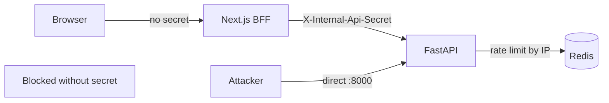

# Security

AiCrateDigger implements defense-in-depth for a public-facing search application with paid external API dependencies. There is no user authentication — security focuses on **API access control**, **abuse prevention**, and **production hardening**.

---

## Threat model

| Threat | Mitigation |
|--------|------------|
| Unauthorized backend access | Internal API secret (BFF-only) |
| IP spoofing for rate limits | XFF trusted only with valid secret |
| API cost abuse | Per-IP rate limits + global daily quotas |
| Redis unavailable → unlimited calls | Fail-closed rate limit and quota modes |
| Secret leakage to browser | BFF pattern; no `NEXT_PUBLIC_*` for secrets |
| OpenAPI reconnaissance | Docs disabled in production |
| Query injection / oversized input | Pydantic validation, max query length |
| Tavily burst throttling | Per-request circuit breaker |

**Out of scope:** User accounts, RBAC, WAF, DDoS protection at network edge (deployer responsibility).

---

## Architecture boundary



In production Compose, port 8000 is not published. Attackers must reach the backend through the Docker network or a misconfigured proxy.

---

## Internal API authentication

### Backend

**Module:** `app/core/internal_auth.py`

**Function:** `require_internal_api_secret()`

| Condition | Behavior |
|-----------|----------|
| `INTERNAL_API_SECRET` unset | Bypass (development only) |
| Secret set, header missing/wrong | 401 Unauthorized |
| Secret set, header correct | Proceed |

Validation uses `hmac.compare_digest` for constant-time comparison.

**Header:**

```
X-Internal-Api-Secret: <shared-secret>
```

Applied to all routes in `app/api/routers/search.py` via router dependencies.

### Frontend

**Module:** `frontend/lib/production-guard.ts`

**Function:** `assertProductionBffReady()`

| Condition | Behavior |
|-----------|----------|
| `NODE_ENV !== "production"` | No-op |
| Production, secret missing | Throws at route handler (500 to client) |
| Production, secret set | Proceed |

**Module:** `frontend/lib/backend-proxy-headers.ts`

Attaches secret to outbound backend requests when env var is set.

### Contract

Both services must share the **same** `INTERNAL_API_SECRET` value. Generate for production:

```bash
openssl rand -hex 32
```

Never commit real secrets. `.env` is gitignored.

---

## Client IP resolution

**Module:** `app/core/client_ip.py`

**Function:** `resolve_client_ip(request)`

| Condition | IP source |
|-----------|-----------|
| Valid internal secret + `X-Forwarded-For` | First XFF hop |
| Valid secret + `X-Real-IP` | Real IP header |
| Otherwise | Direct connection IP |

Prevents clients from spoofing XFF to evade rate limits or exhaust another IP's quota bucket.

---

## Rate limiting

**Module:** `app/core/rate_limiter.py`

**Function:** `ip_rate_limiter()`

| Setting | Default |
|---------|---------|
| Enabled | `SEARCH_RATE_LIMIT_ENABLED=true` |
| Max requests | 5 per IP |
| Window | 86400 seconds (24 hours) |
| Fail-closed | `SEARCH_RATE_LIMIT_FAIL_CLOSED=true` |

**Implementation:** Redis sorted-set sliding window. Key: `rate_limit:api:{ip}`.

**Scope:** Shared bucket across `/parse`, `/search`, `/search-listings`.

| Outcome | Status |
|---------|--------|
| Under limit | Request proceeds |
| Over limit | 429 Too Many Requests |
| Redis down (fail-closed) | 503 Service Unavailable |

Frontend displays a dedicated `RateLimitModal` on 429.

---

## Global daily quotas

**Module:** `app/core/quota/service.py`

Account-wide daily caps on expensive provider calls. Counters in Redis, UTC midnight reset.

| Quota kind | Enforced at | Default |
|------------|-------------|---------|
| `PARSE` | `parse_user_query` | 500/day |
| `TAVILY` | Tavily HTTP client | 200/day |
| `OPENAI_EXTRACT` | Extract + store discovery LLM | 300/day |

| Setting | Default |
|---------|---------|
| Enabled | `GLOBAL_DAILY_QUOTA_ENABLED=true` |
| Fail-closed | `GLOBAL_DAILY_QUOTA_FAIL_CLOSED=true` |

| Outcome | Status |
|---------|--------|
| Under quota | Call proceeds, counter incremented |
| Over quota | 503 via `QuotaExceededError` handler |
| Redis down (fail-closed) | 503 via `QuotaUnavailableError` handler |

Set cap to `0` for unlimited on a specific bucket.

---

## Production startup guard

**Module:** `app/core/production_guard.py`

**Function:** `validate_production_settings(settings)`

Called at import time in `app/main.py`. Raises `RuntimeError` on startup if `APP_ENV=production` and:

| Requirement | Reason |
|-------------|--------|
| `DEBUG=false` | Prevents debug payload leakage |
| `INTERNAL_API_SECRET` set | BFF auth required |
| Rate limit enabled + fail-closed | Abuse protection |
| Quota enabled + fail-closed | Cost protection |
| `DATABASE_URL` configured | Persistent store catalogue |
| `REDIS_URL` configured | Cache, limits, quotas |

**Warning (non-fatal):** `LOG_FORMAT != "json"` — structured logging recommended.

---

## API surface hardening

| Control | Implementation |
|---------|----------------|
| OpenAPI disabled | `docs_url=None` when `APP_ENV=production` |
| Query length cap | `SEARCH_QUERY_MAX_LENGTH` (default 512) |
| Input validation | Pydantic `ParseRequest` min/max length |
| Error sanitization | Generic 502 messages; no stack traces in responses |
| DB URL masking | `mask_database_url()` in logs |

---

## Tavily circuit breaker

**Module:** `app/domains/engine/search/circuit_breaker.py`

**Function:** `tavily_circuit_breaker_scope()`

Wraps each search request. Fails fast when Tavily returns burst throttling errors, preventing retry storms.

Configurable via `TAVILY_CIRCUIT_BREAKER_FAILURE_THRESHOLD` (default 2).

---

## Cache security

| Control | Purpose |
|---------|---------|
| No cache write on empty/failed pipeline | Prevents cache poisoning with bad results |
| DEBUG bypasses cache reads | Ensures fresh traces during investigation |
| Schema version in key | Invalidates stale cached responses on pipeline changes |

---

## Frontend security headers

**File:** `frontend/next.config.mjs`

| Header | Value |
|--------|-------|
| `X-Frame-Options` | DENY or SAMEORIGIN |
| `X-Content-Type-Options` | nosniff |
| `Referrer-Policy` | strict-origin-when-cross-origin |
| `Permissions-Policy` | Restricted features |

`poweredByHeader: false` — hides Next.js version header.

---

## Secrets management

| Secret | Storage | Exposure |
|--------|---------|----------|
| `OPENAI_API_KEY` | Backend env only | Never in frontend |
| `TAVILY_API_KEY` | Backend env only | Never in frontend |
| `INTERNAL_API_SECRET` | Backend + frontend server env | Never in browser |
| `POSTGRES_PASSWORD` | Compose env / secrets manager | Internal network only |

**Do not:**

- Commit `.env` to git
- Use `NEXT_PUBLIC_` prefix for secrets
- Leave `INTERNAL_API_SECRET` unset in production
- Publish backend port 8000 in production

---

## Production checklist

- [ ] `APP_ENV=production`
- [ ] `DEBUG=false`
- [ ] Strong `INTERNAL_API_SECRET` on backend and frontend
- [ ] `SEARCH_RATE_LIMIT_ENABLED=true`, fail-closed
- [ ] `GLOBAL_DAILY_QUOTA_ENABLED=true`, fail-closed
- [ ] `DATABASE_URL` and `REDIS_URL` set
- [ ] `LOG_FORMAT=json`
- [ ] HTTPS via reverse proxy
- [ ] `FRONTEND_PUBLIC_URL` matches public domain
- [ ] No `NEXT_PUBLIC_DEV_INSPECTOR`
- [ ] Backend port not publicly exposed
- [ ] `.env` not in version control

See [Deployment](./deployment.md) and [Configuration](./configuration.md).

---

## Incident response

| Scenario | Action |
|----------|--------|
| Secret leaked | Rotate `INTERNAL_API_SECRET`; restart backend + frontend |
| API cost spike | Lower quota caps; check rate limit logs; disable service temporarily |
| Redis compromise | Rotate Redis; flush quota/rate limit keys |
| Tavily key abuse | Rotate Tavily key; review quota counters |

Logs with `LOG_FORMAT=json` support aggregation and alerting on 429/503 rates.
